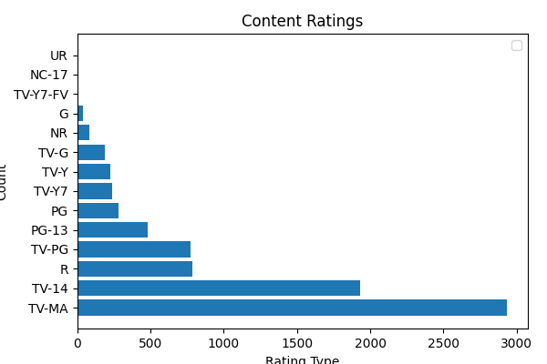
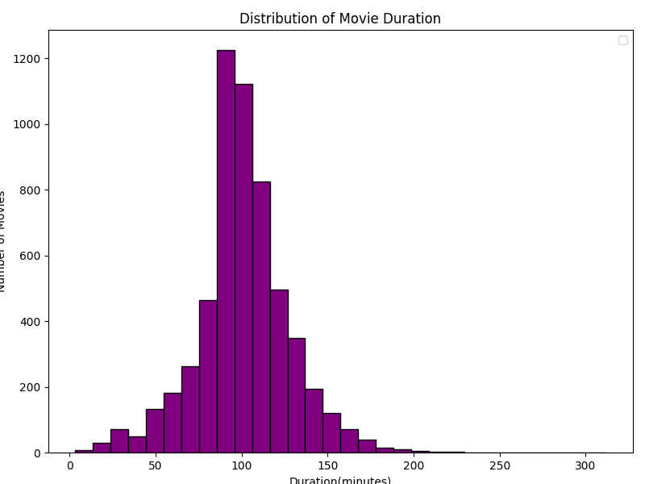
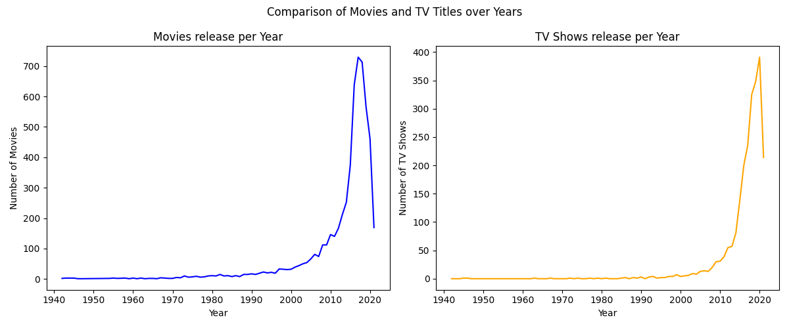
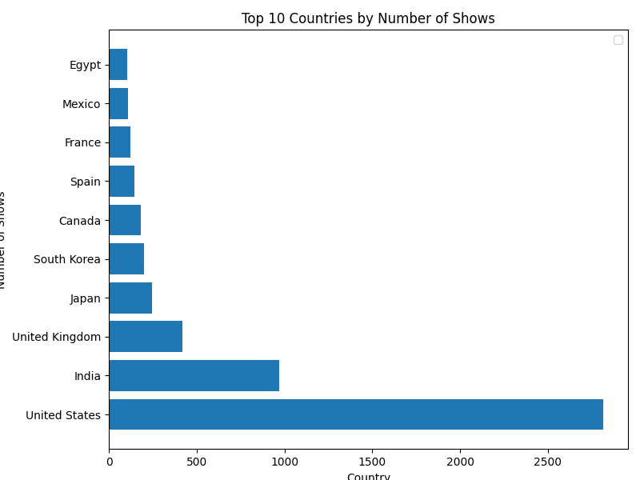

# 🎬 Netflix Data Analysis: Movies vs TV Shows 📺

[](https://www.python.org/)
[](https://pandas.pydata.org/)
[](https://matplotlib.org/)

Welcome to a deep-dive into Netflix’s global library!  
This project uncovers fascinating trends, patterns, and insights by comparing **Movies** and **TV Shows** available on Netflix.  
*All analyses, visualizations, and code are included for your exploration and inspiration.*

---

## 🚀 Project Overview

Netflix has revolutionized the way we watch content. But have you ever wondered:
- Are there more movies or TV shows on Netflix?
- How do release trends vary over the years?
- What are the most common content ratings?
- Which countries dominate the Netflix catalog?

This project answers these questions and more through data analysis and rich visualizations.

---

## 📦 Dataset

- **Source:** [Netflix Titles Dataset](https://www.kaggle.com/datasets/shivamb/netflix-shows)
- **Files:** `netflix_titles.csv`  
  *(Contains all Netflix titles till 2021 with attributes like type, title, country, release year, rating, and duration.)*

---

## 🧰 Features & Analysis

- Data Cleaning & Preprocessing
- Exploratory Data Analysis (EDA)
- **Visualizations:**  
  - 📊 Content Ratings Distribution  
  - ⏱️ Movie Duration Histogram  
  - 📈 Yearly Trends for Movies vs TV Shows  
  - 🌍 Top Contributing Countries  
  - 🥧 Movies vs TV Shows Pie Chart  

---

## 🖼️ Sample Visualizations

| Content Ratings Distribution | Movie Duration Histogram |
|:---------------------------:|:-----------------------:|
|  |  |

| Movies vs TV Shows Over Years | Top 10 Countries |
|:-----------------------------:|:---------------:|
|  |  |

---

## 📝 Steps

See `Steps.txt` for a high-level workflow:

1. Load the data
2. Clean and preprocess
3. Explore and visualize
4. Draw insights!

---

## 💡 Key Insights

- Movies outnumber TV Shows on Netflix by a significant margin.
- Majority of content is rated for mature audiences (`TV-MA` and `TV-14`).
- Most movies are between 80–120 minutes long.
- The United States and India are the largest contributors to Netflix’s library.

---

## 🛠️ Tech Stack

- **Python 3.8+**
- **Pandas** for data handling
- **Matplotlib** for visualizations
- **Jupyter Notebook** for analysis

---

## 📈 Run the Analysis

Clone the repo and open `Analysis.ipynb` in Jupyter Notebook or VSCode.  
All code and charts are ready to run!

```bash
git clone https://github.com/<yourusername>/<your-repo>.git
cd <your-repo>
jupyter notebook Analysis.ipynb


Dataset - https://www.kaggle.com/datasets/shivamb/netflix-shows